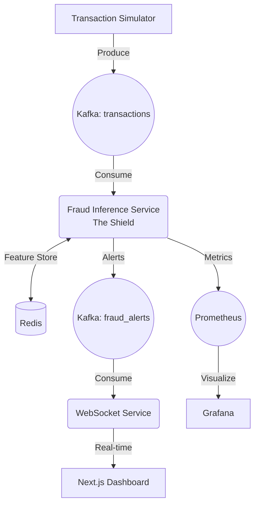
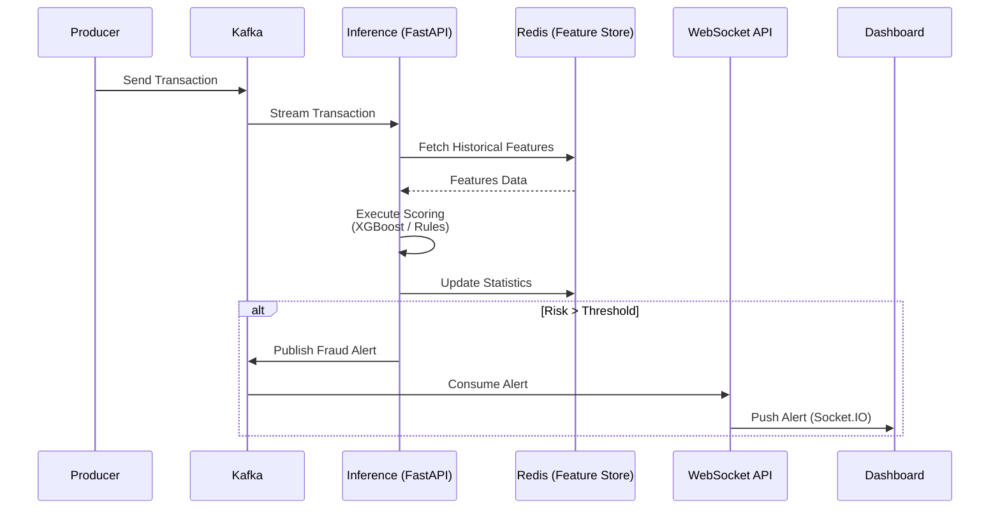
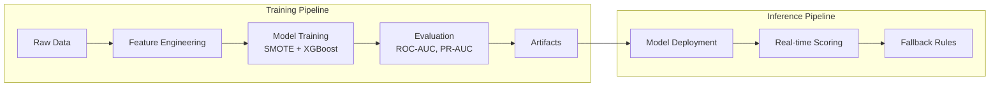

```mermaid
graph TD
  A[Transaction Simulator] -->|Produce| B((Kafka: transactions))
  B -->|Consume| C(Fraud Inference Service<br>The Shield)
  C <-->|Feature Store| D[(Redis)]
  C -->|Alerts| E((Kafka: fraud_alerts))
  E -->|Consume| F(WebSocket Service)
  F -->|Real-time| G[Next.js Dashboard]
  C -->|Metrics| H((Prometheus))
  H -->|Visualize| I[Grafana]
```

```mermaid
sequenceDiagram
  participant P as Producer
  participant K as Kafka
  participant I as Inference (FastAPI)
  participant R as Redis (Feature Store)
  participant W as WebSocket API
  participant D as Dashboard
  
  P->>K: Send Transaction
  K->>I: Stream Transaction
  I->>R: Fetch Historical Features
  R-->>I: Features Data
  I->>I: Execute Scoring <br>(XGBoost / Rules)
  I->>R: Update Statistics
  
  alt Risk > Threshold
      I->>K: Publish Fraud Alert
      K->>W: Consume Alert
      W->>D: Push Alert (Socket.IO)
  end
```

```mermaid
flowchart LR
    subgraph Offline [Training Pipeline]
      A[Raw Data] --> B[Feature Engineering]
      B --> C[Model Training<br>SMOTE + XGBoost]
      C --> D[Evaluation<br>ROC-AUC, PR-AUC]
      D --> E[Artifacts]
    end

    subgraph Online [Inference Pipeline]
      E --> F[Model Deployment]
      F --> G[Real-time Scoring]
      G --> H[Fallback Rules]
    end
```
